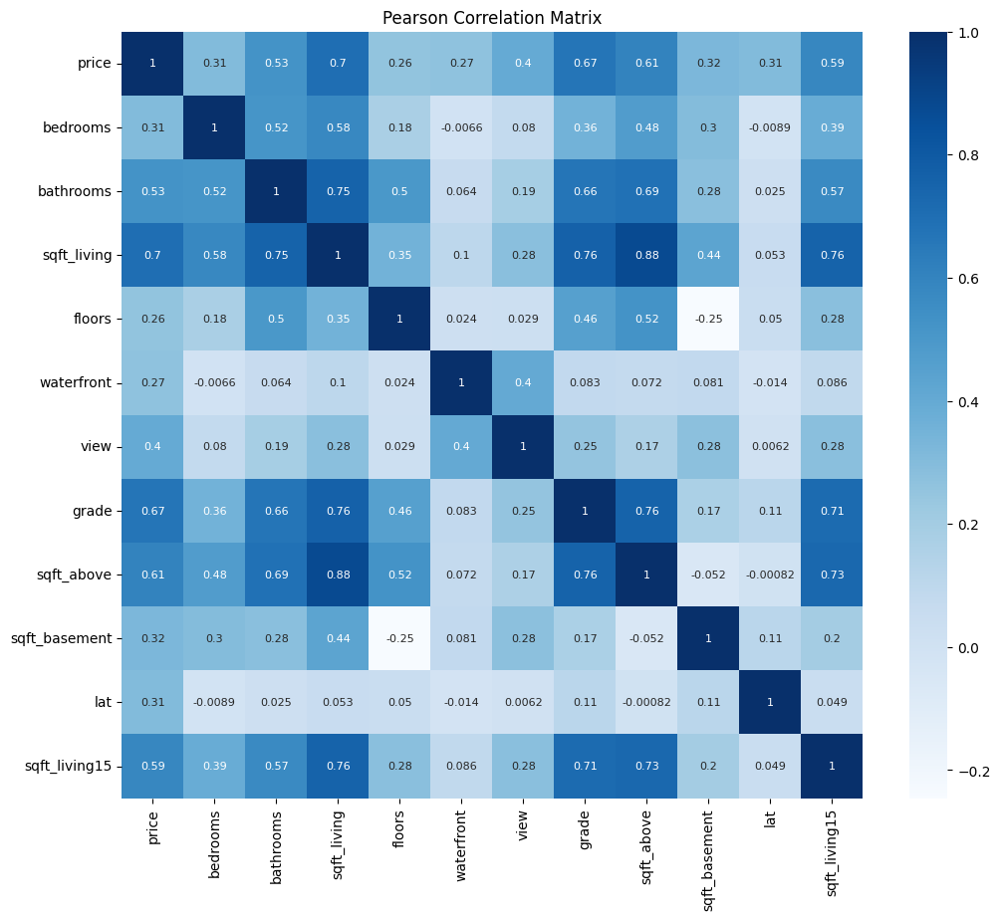

# Multivariate Linear Regression Using Gradient Descent

Implementation using Jupyter Notebook and Python libraries such as:

- Numpy
- Pandas
- Seaborn

## Cost Function Formula

The cost function \( J(\theta) \) is given by:

The cost function \( J(\theta) \) is given by:

\[
J(\theta) = \frac{1}{2m} \sum_{i=1}^{m} \left( h_\theta(x^{(i)}) - y^{(i)} \right)^2
\]

Where \( h_\theta(x) \) is the hypothesis function:

\[
h_\theta(x) = \theta_0 + \theta_1 x_1 + \theta_2 x_2 + \dots + \theta_n x_n
\]

The gradient descent update rule for \( \theta_j \) is:

\[
\theta_j := \theta_j - \frac{\alpha}{m} \sum_{i=1}^{m} \left( h_\theta(x^{(i)}) - y^{(i)} \right) x_j^{(i)}
\]

Where \( j = 0, 1, \dots, n \) and \( \alpha \) is the learning rate.

## Correlation Matrix Heatmap (Pearson)

